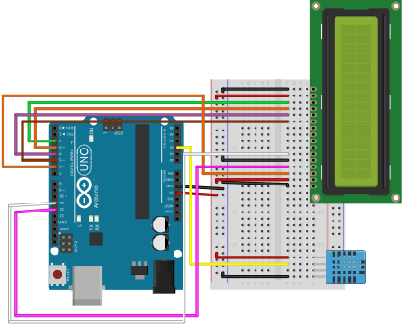
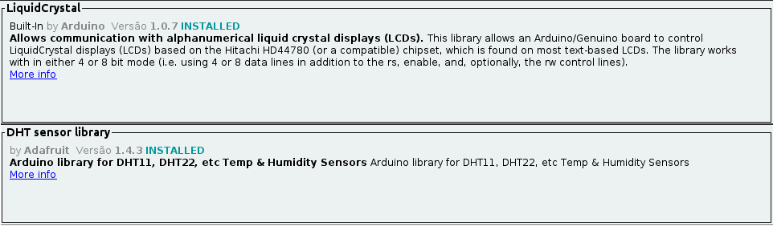

# Monitor Ambiente :thermometer:

    <a href="#requisitos">Requisitos</a> .
    <a href="#funcionamento">Funcionamento</a> .
    <a href="#esquematico">Esquemático</a> .
    <a href="#primeiros-passos">Primeiros Passos</a>

## Requisitos

* [Node.js](https://nodejs.org/)
* [Angular](https://angular.io/)
* [Python](https://www.python.org/)
* [PostgreSQL](https://www.postgresql.org/)
* [Arduino IDE](https://www.arduino.cc/)

## Funcionamento

O projeto trata de uma aplicação IoT que recebe dados por um sensor DHT11 e os exibe em um LCD, isso por meio de uma placa Arduino Uno.

Por meio do **postingData.py**, capturamos os dados da placa pela porta serial, isso graças a biblioteca _PySerial_. Contudo considerando a existência de um _delay_ de 4s para o recebimento dos dados. Os dados recebidos serão convertidos ao formato JSON e enviados ao banco de dados _PostegreSQL_, isso através de uma requisição _POST_ ao Backend Django.

O Frontend irá tomar esses dados considerando uma conexão com servidor _websocket_, implementado no Django, isso para uma melhor comunicação entre Frontend e Backend em tempo real.

Vale ressaltar que devido ao uso do Django admin, e do Django Rest Framework, podemos verificar os dados inseridos (temperatura, umidade, horario de inserção).

## Esquematico

 O esquemático do circuito pode ser visto conforme a imagem logo abaixo:

## Primeiros-passos

### 1. Angular  

Primeiro iremos instalar todos os módulos do Frontend (angularFrontEnd), para isso devemos usar o comando :

~~~bash
$ npm install
~~~

Com isso, teremos todos os módulos necessários para o funcionamento instalados.

### 2. Python

No caso do Python, devemos fazer a criação do ambiente virtual (virtual environment), utilizando o comando :

~~~bash
$ python -m venv your_virtual_env_name
~~~

Com o ambiente criado entraremos na pasta criada e, no caso do linux, basta ativarmos nosso ambiente através do comando : 

~~~bash
$ . bin/activate
~~~

Tendo o ambiente ativado basta executarmos o seguinte comando para instalarmos as dependências utilizados no **djangoBackEnd** e no **postingData** :

~~~bash
$ pip install -r requirements.txt
~~~

### 3. Arduino IDE

Para fucionamento do código Arduino basta instalarmos as seguintes bibliotecas da imagem abaixo :

### 4. PostgreSQL

 O primeiro passo para o funcionamento do projeto é a criação do banco de dados, conforme o nome atribuido em **setting.py** do Django (Além de inserir nome de usuário e senha do PostgreSQL em **setting.py**).

 Com banco de dados criado, devemos executar os seguintes comandos em **djangoBackEnd**:

~~~bash
$ python manage.py migrate
$ python manage.py createsuperuser --username your_username
~~~

Assim temos o django admin criado, com isso falta criarmos o modelo dentro do banco de dados, ou seja, a criação da tabela que conterá todos os dados. Isso deve ser feito pelos comandos :

~~~bash
$ python manage.py makemigration core
$ python manage.py migrate core 0001
~~~

Logo nosso banco está preparado para o uso. Além disso, é necessário executar o **postingDatapy** para que sejam inseridos os primeiros dados para o banco, isso tambem pode ser contornado fazendo uma requisição POST utilizando a pagina do Django Rest Framework em http://localhost:8000/.

---
Made by Matheus Harduim :wave: